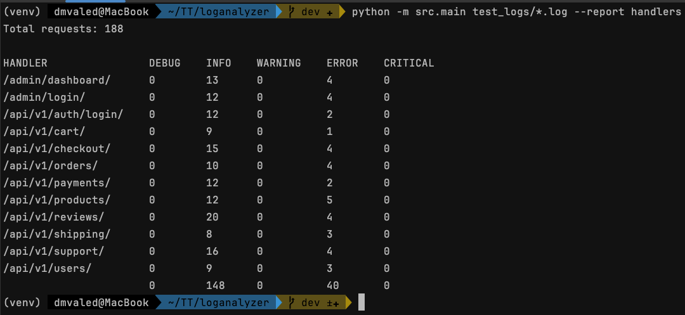
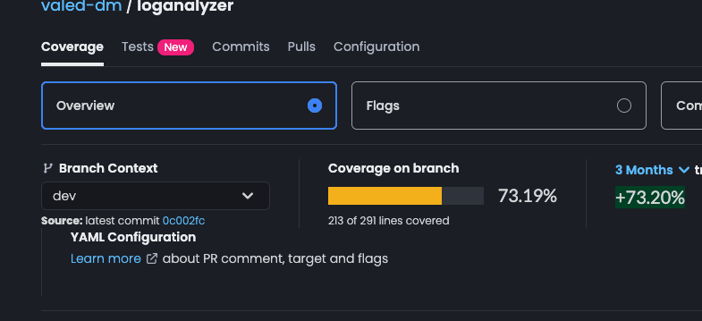
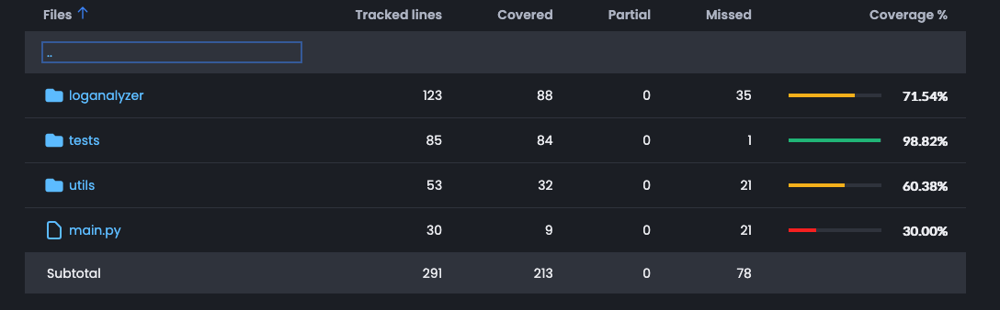
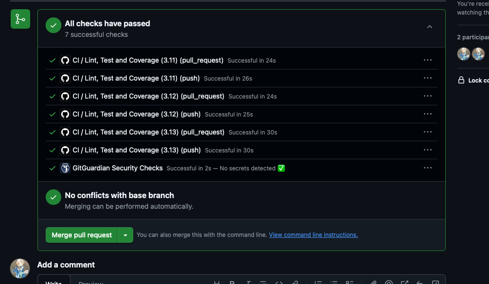

# Django Log Analyzer


A high-performance log analysis tool for Django applications that extracts meaningful insights from request logs.

## Features ✨

- **Request Statistics**: Breakdown by endpoint and HTTP method
- **Error Analysis**: Identify problematic endpoints
- **Multi-file Processing**: Analyze logs from multiple servers
- **Performance**: Parallel processing with multiprocessing
- **Flexible Input**: Handles various log formats and encodings

## Installation 🛠️

1. **Clone the repository**:
   ```bash
   git clone https://github.com/valed-dm/loganalyzer.git
   gh repo clone valed-dm/loganalyzer
   cd loganalyzer
   ```
2. **Set up virtual environment**:
   ```bash
   python -m venv venv
   source venv/bin/activate  # Linux/MacOS
   # venv\Scripts\activate  # Windows
   ```
3. **Install dependencies**:
   ```bash
   pip install poetry
   poetry install --no-root
   ```
4. **Usage**

   **Basic Analysis**:
   ```bash
   python -m src.main /path/to/your/logs/*.log
   ```

#### Advanced Options:

| Command             | Description                        | Example Usage               |
|---------------------|------------------------------------|-----------------------------|
| `--report handlers` | Show endpoint statistics (default) | `--report handlers`         |
| `--detect-levels`   | Display all log levels present     | `--detect-levels`           |
| `--output FORMAT`   | Export results (csv/json)          | `--output csv > report.csv` |

#### Examples:

```bash
# Analyze all logs in directory
python -m src.main /var/log/django/*.log --report handlers

# Detect log levels only
python -m src.main /var/log/django/*.log --detect-levels

# Save results to CSV
python -m src.main test_logs/*.log --report csv --output reports/my_report.csv

```

#### Output

| HANDLER             | WARNING | DEBUG | INFO    | CRITICAL | ERROR  |
|---------------------|---------|-------|---------|----------|--------|
| /admin/dashboard/   | 0       | 0     | 13      | 0        | 4      |
| /admin/login/       | 0       | 0     | 12      | 0        | 4      |
| /api/v1/auth/login/ | 0       | 0     | 12      | 0        | 2      |
| /api/v1/cart/       | 0       | 0     | 9       | 0        | 1      |
| /api/v1/checkout/   | 0       | 0     | 15      | 0        | 4      |
| /api/v1/orders/     | 0       | 0     | 10      | 0        | 4      |
| /api/v1/payments/   | 0       | 0     | 12      | 0        | 2      |
| /api/v1/products/   | 0       | 0     | 12      | 0        | 5      |
| /api/v1/reviews/    | 0       | 0     | 20      | 0        | 4      |
| /api/v1/shipping/   | 0       | 0     | 8       | 0        | 3      |
| /api/v1/support/    | 0       | 0     | 16      | 0        | 4      |
| /api/v1/users/      | 0       | 0     | 9       | 0        | 3      |
| **Total**           | **0**   | **0** | **148** | **0**    | **40** |

#### Supported Log Format

The analyzer processes Django request logs in the following format:
TIMESTAMP LEVEL django.request: METHOD /path [STATUS] [RESPONSE_TIME]

#### Components:

- `TIMESTAMP`: `YYYY-MM-DD HH:MM:SS,LLL` (e.g., `2025-03-28 12:44:46,000`)
- `LEVEL`: Log severity level (`DEBUG`, `INFO`, `WARNING`, `ERROR`, `CRITICAL`)
- `METHOD`: HTTP method (`GET`, `POST`, `PUT`, `DELETE`, `PATCH`)
- `/path`: Request endpoint path
- `STATUS`: (Optional) HTTP status code
- `RESPONSE_TIME`: (Optional) Response duration

#### Examples:

```log
# Standard request
2025-03-28 12:44:46,000 INFO django.request: GET /api/v1/reviews/ 204 142ms

# Error case
2025-03-28 12:11:57,000 ERROR django.request: POST /admin/dashboard/ 500 210ms

# Minimal format
2025-03-28 12:05:33,000 INFO django.request: GET /api/v1/users/
```

### Screenshots:

[]()

[]()

[]()

[]()